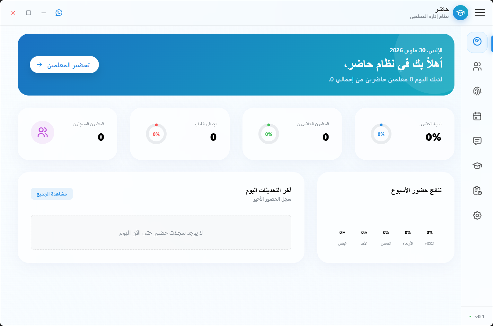
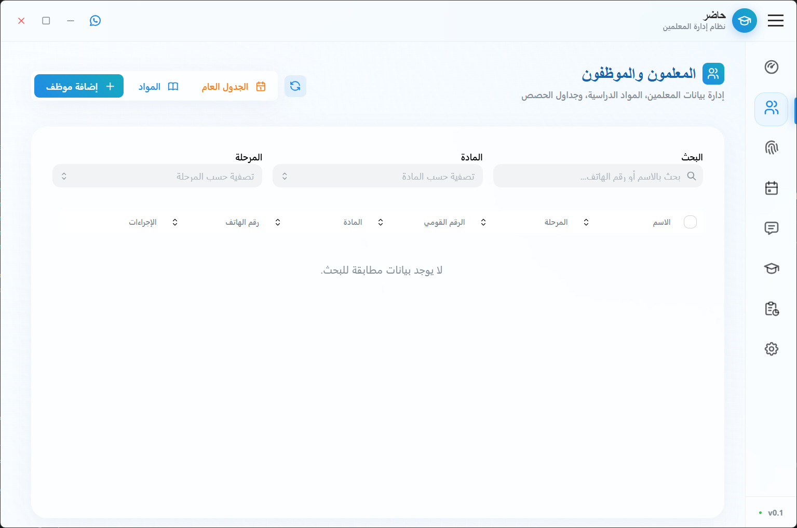
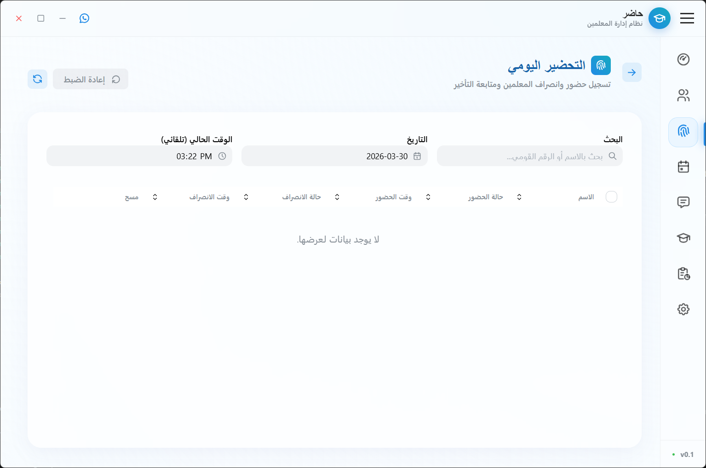
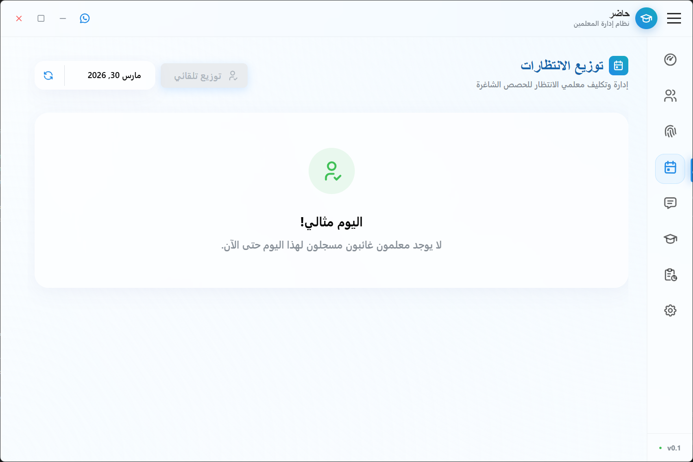
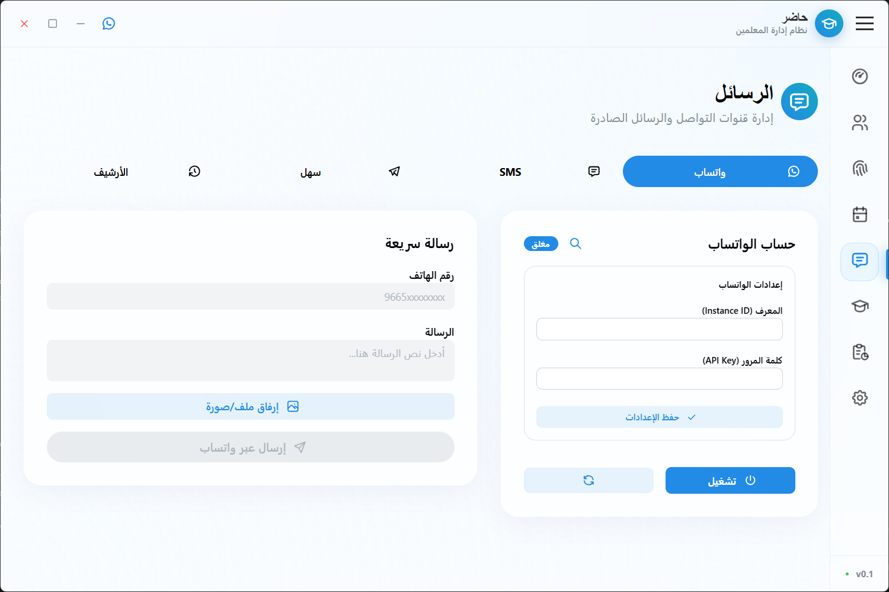
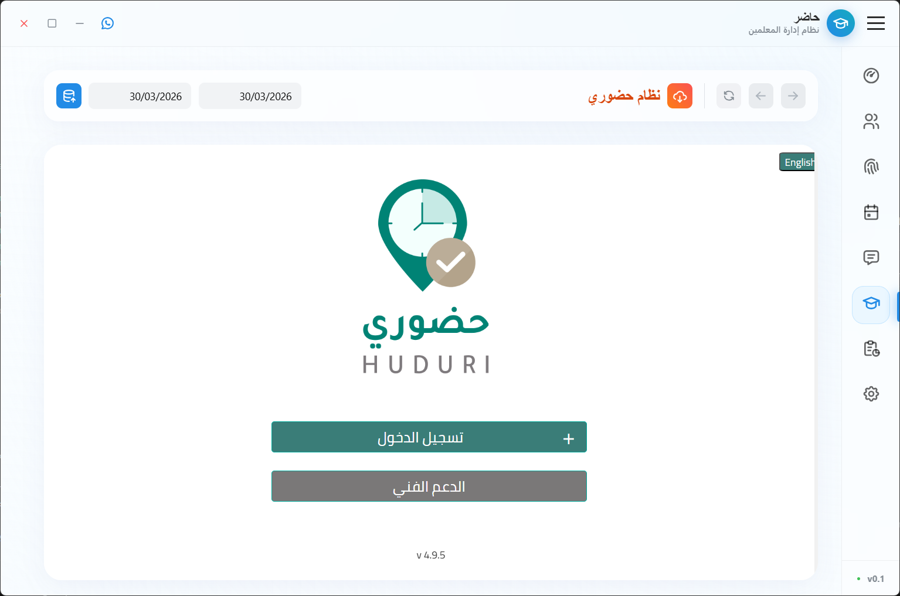
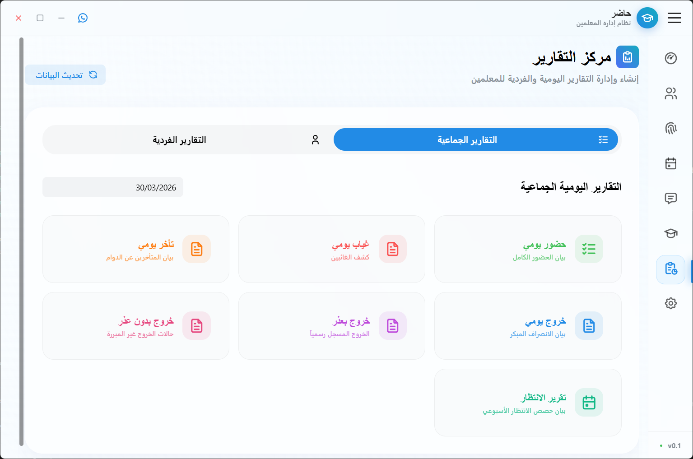
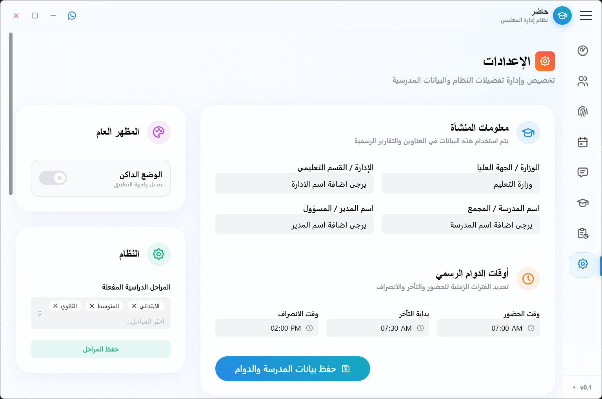

  <h1 align="center">Hader Teachers (حاضر للمعلمين)</h1>
  

    <b>Premium desktop application for teacher management, attendance, and school communication.</b>
     
    
    
    
  

---

## 📥 Download Hader Teachers

  

To get started, download the latest `.exe` installer from the [Releases](https://github.com/ANOOBALSA/Hader-Teachers-Release/releases/latest) page.

---

## 📸 Screenshots (صور التطبيق)

  
  

  
<b>View More Screenshots (عرض المزيد من الصور)</b>

  

    
    
     
    
    
     
    
    
  

---

## ✨ Key Features (المميزات الرئيسية)

| Feature           | Description                                     | الميزة                   |
| :---------------- | :---------------------------------------------- | :----------------------- |
| **📅 Attendance** | Advanced teacher attendance tracking.           | **نظام حضور متطور**      |
| **👨‍🏫 Directory**  | Centralized database for school records.        | **دليل المعلمين الشامل** |
| **📊 Dashboard**  | Real-time analytics and school insights.        | **تحليل ذكي للبيانات**   |
| **📱 Messaging**  | Integrated WhatsApp, SMS, and Sahl.             | **تواصل متعدد القنوات**  |
| **📜 Reports**    | Comprehensive attendance & performance reports. | **تقارير احترافية**      |
| **🔐 Activation** | Secure licensing for educational institutions.  | **نظام تفعيل آمن**       |

---

## 🚀 Quick Start Guide (دليل البدء السريع)

### 1. Installation (التثبيت)

1.  Download the latest `HaderTeachers-Setup.exe` from the [Download Link](https://github.com/ANOOBALSA/Hader-Teachers-Release/releases/latest).
2.  Run the installer and follow the on-screen instructions.
3.  Launch **Hader Teachers** from your desktop shortcut.

### 2. Activation (التفعيل)

- Upon first launch, you will be prompted to enter your **Serial Number**.
- Please contact your school administrator or **Alsasoft Support** ([hader4schools.com](https://hader4schools.com)) to receive your activation key.
- _An active internet connection is required for the first activation._

---

## 💻 System Requirements

- **OS**: Windows 10 / Windows 11 (64-bit)
- **Storage**: 500MB availability
- **RAM**: 4GB Minimum (8GB Recommended)

---

## 📜 License

This application is licensed under the [MIT License](LICENSE).

---

## 🌐 Support & Contact (الدعم والتواصل)

Developed by **Alsasoft**.
For support or license inquiries, visit [hader4schools.com](https://hader4schools.com).

---

_Empowering educators with better management tools._
